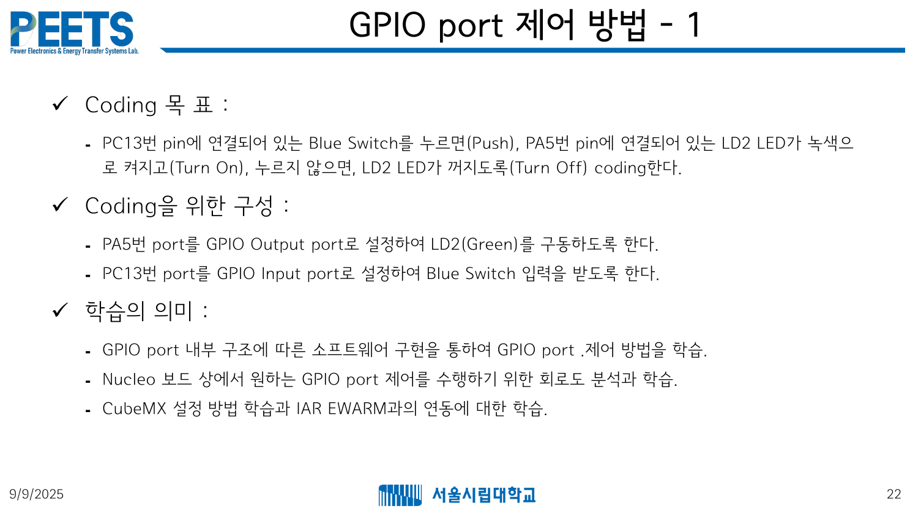
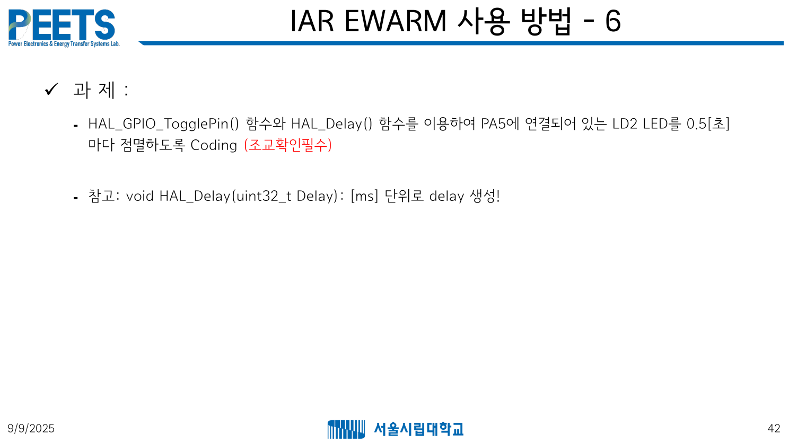

# HW1
- 
- 
- contents/Lec02 - STM32 Fundamentals (GPIO)_dist.pdf

## TODO
- 2개 기능 작동 확인하기
    1. 버튼 눌려있을 때 LED 켜지게 loop로 구현하기
    2. LED 0.5초마다 점멸하도록 loop로 구현하기

### 기능1
- Coding 목 표 :
    - PC13번 pin에 연결되어 있는 Blue Switch를 누르면(Push), PA5번 pin에 연결되어 있는 LD2 LED가 녹색으로 켜지고(Turn On), 누르지 않으면, LD2 LED가 꺼지도록(Turn Off) coding한다.
- Coding을 위한 구성 :
    - PA5번 port를 GPIO Output port로 설정하여 LD2(Green)를 구동하도록 한다.
    - PC13번 port를 GPIO Input port로 설정하여 Blue Switch 입력을 받도록 한다.
- 학습의 의미 :
    - GPIO port 내부 구조에 따른 소프트웨어 구현을 통하여 GPIO port .제어 방법을 학습.
    - Nucleo 보드 상에서 원하는 GPIO port 제어를 수행하기 위한 회로도 분석과 학습.
    - CubeMX 설정 방법 학습과 IAR EWARM과의 연동에 대한 학습

### 기능2
- 과제:
    - HAL_GPIO_TogglePin() 함수와 HAL_Delay() 함수를 이용하여 PA5에 연결되어 있는 LD2 LED를 0.5[초] 마다 점멸하도록 Coding (조교확인필수)
    - 참고: void HAL_Delay(uint32_t Delay): [ms] 단위로 delay 생성!